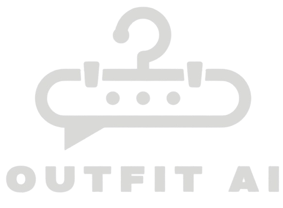

# OUTFIT_AI - Your AI-Powered Wardrobe Assistant



## 🔗 Live Demo
[Try OUTFIT_AI](https://lnkd.in/g_yyNag5)

## 📱 Download the App
Scan the QR code on our [download page](https://lnkd.in/gY2XSSKb) to get OUTFIT_AI on your mobile device.

## 📖 Overview

Ever stood in front of your wardrobe thinking, "I have nothing to wear"? OUTFIT_AI is your smart wardrobe assistant powered by artificial intelligence to revolutionize how you interact with your clothes.

## ✨ Features

- 🌦️ **Weather-Based Recommendations**: Get outfit suggestions based on current weather and your location
- 📅 **Weekly Outfit Planner**: Plan your outfits for the entire week
- 🧺 **Digital Wardrobe**: Upload and organize your clothes digitally
- 👕 **Mannequin Preview**: Visualize outfits on a 3D mannequin before trying them on
- 🧍‍♂️ **Outfit Sharing**: Share your outfit combinations with friends
- 💬 **AI Fashion Assistant**: Chat with our AI for style advice and fashion tips
- 🛍️ **Smart Shopping**: Sell clothes you no longer need
- 🤖 **AI-Powered Suggestions**: Get personalized recommendations to complete your outfits
- 💡 **Price Comparison**: Compare prices from Amazon & Myntra through smart scraping
- 🎯 **Personalized Experience**: Recommendations tailored to your age, gender, and preferences

## 🛠️ Technology Stack

### Frontend
- React.js with Vite
- CSS for styling
- Three.js for 3D mannequin visualization
- Socket.io for real-time features

### Backend
- Node.js with Express
- MongoDB for database
- Passport.js for authentication (Google & Facebook OAuth)
- JWT for session management
- Socket.io for real-time communication

### AI & Machine Learning
- Computer Vision for clothing recognition
- Natural Language Processing for chat assistant
- Recommendation algorithms for outfit suggestions

## 🚀 Getting Started

### Prerequisites
- Node.js (v14 or higher)
- MongoDB
- npm or yarn

### Installation

1. Clone the repository
   ```bash
   git clone https://github.com/yourusername/aiWardrobe.git
   cd aiWardrobe
   ```

2. Install backend dependencies
   ```bash
   cd backend
   npm install
   ```

3. Install frontend dependencies
   ```bash
   cd ../frontend
   npm install
   ```

4. Set up environment variables
   - Create `.env` files in both frontend and backend directories
   - See `.env.example` for required variables

5. Start the development servers
   ```bash
   # In backend directory
   npm run dev
   
   # In frontend directory
   npm run dev
   ```

## 🔐 Authentication

OUTFIT_AI supports multiple authentication methods:
- Email/Password registration
- Google OAuth
- Facebook OAuth

## 👨‍💻 Contributors

- Aditya Kurani
- Paras Rana
- Mohit Bhalotia (Launch Support)

## 📄 License

This project is licensed under the MIT License - see the LICENSE file for details.

## 📞 Contact

For any inquiries, please reach out to us at [your-email@example.com]

---

Stay stylish. Stay smart with OUTFIT_AI.
